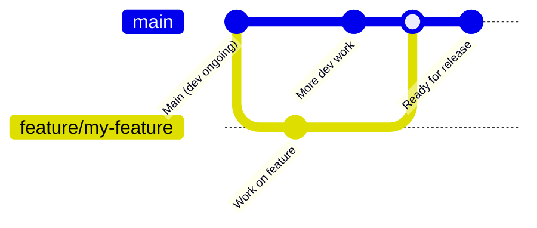

# Contributing Guide

Thanks for your interest in contributing! ✨
Whether you're fixing a bug, refining documentation, improving performance, or adding a new feature — your help is appreciated.

This guide walks you through:

* Setting up a local development environment
* Writing and running tests
* Our conventions for PRs and commit formatting
* How to sign your commits (we follow the DCO)
* Where to ask for help or offer ideas

---

## Topics

* [Setting up your development environment](#setting-up-your-development-environment)
* [Running tests](#running-tests)
* [Reporting issues](#reporting-issues)
* [Contribution guidelines](#contribution-guidelines)

  * [Pull request process](#pull-request-process)
  * [Commit message format](#commit-message-format)
  * [Sign your commits (DCO)](#sign-your-commits-dco)
* [Style and conventions](#style-and-conventions)
* [Release process](#release-process)
* [Thank you](#thank-you-🙏)

---

## Setting up your development environment

To get started:

```bash
git clone git@github.com:ORG/REPO.git
cd REPO
# Optional but recommended: python -m venv venv && source venv/bin/activate
make install
```

This installs the package and its dependencies.

---

## Running tests

Run all tests with:

```bash
make test
```

Or target a specific test file:

```bash
pytest -v tests/test_example.py
```

Before opening a PR, make sure all tests pass locally.

---

## Reporting issues

If you’ve found a bug or have a feature request, please [open an issue](https://github.com/ORG/REPO/issues) and include:

* What you were trying to do
* What actually happened
* Example config, input, or stack trace if possible

Clear minimal examples or failing tests are especially helpful.

---

## Contribution guidelines

### Pull request process

* Create a feature branch (e.g. `fix-parsing-error`, `optimize-performance`)
* Keep changes focused and atomic
* Include or update relevant tests
* Run `make test` before pushing
* Sign your commits (see below)
* Open your PR against `main`

### Commit message format

Use this structure:

```
Short summary (max 50 chars)

Optional detailed explanation with context and rationale.
Reference any related issues using "Closes #123".
```

Use the `-s` flag to sign your commit.

---

### Sign your commits (DCO)

All commits must be signed using the **Developer Certificate of Origin (DCO)**.

```bash
git commit -s -m "Fix parsing error in config loader"
```

Which appends:

```
Signed-off-by: Your Name <your.email@example.com>
```

Unsigned commits will fail CI.

More info: [developercertificate.org](https://developercertificate.org)

---

## Style and conventions

* Code is formatted with `black`
* Linting is enforced using `ruff`
* Use type hints on public methods
* Use comments to explain non-obvious logic
* Keep logic explicit and testable — avoid overly abstract patterns

### Docstrings

Document:

* Config options in configuration classes
* Key logic in `process()` or equivalent core methods
* Behavior for edge cases (e.g., empty input, invalid parameters)

---

## Release Process

We use a structured release workflow to ensure stability, transparency, and traceability of code changes.

### 🧵 Development Flow

* All contributors **branch off of `main`** for any feature, bugfix, or documentation update.
* Pull requests should always **target `main`**, which serves as the active development branch.
* Once PRs are approved and merged into `main`, they are queued for inclusion in the next release.

> 🔒 **Important:** Only **core maintainers** are allowed to publish a release. This ensures all published versions are stable, reviewed, and correctly documented.

---

### 🔄 Diagram: Standard Release Flow



---

## Thank you 🙏

This project is better because of contributors like you.
Whether you’re fixing a bug, improving test coverage, or reviewing code — thank you.

If you have questions or ideas, don’t hesitate to open an issue or PR.
